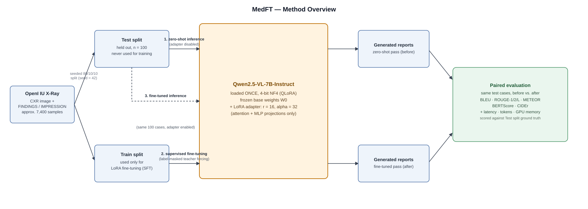
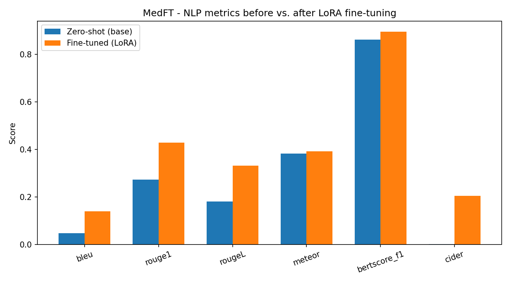
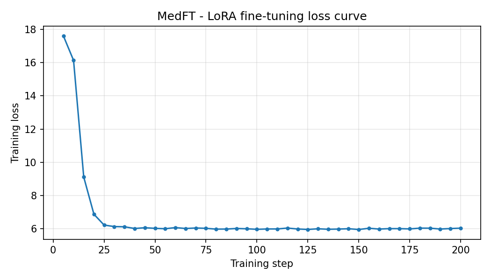

# MedFT : LoRA/QLoRA Fine-Tuning of a Medical Vision-Language Model

**Controlled evaluation of parameter-efficient fine-tuning for medical vision-language report generation.**

MedFT investigates how much supervised LoRA/QLoRA adaptation improves the report-generation performance of a medical vision-language model compared with the **same base model evaluated zero-shot**, using the same prompt and the same held-out test cases.

---

## TL;DR

MedFT fine-tunes **Qwen2.5-VL-7B-Instruct** with LoRA/QLoRA on the OpenI IU X-Ray dataset and evaluates the model before and after adaptation.

The key experimental design is a **paired before/after comparison**:

- the same Qwen2.5-VL-7B-Instruct base model is loaded once in 4-bit;
- the zero-shot baseline is evaluated with the LoRA adapter disabled;
- the model is fine-tuned using LoRA on the training split;
- the same held-out test cases are evaluated again with the adapter enabled;
- both passes use the same prompt and generation settings.

This isolates the effect of parameter-efficient adaptation as much as possible within the experimental setup.

### Key results

Evaluation was performed on **100 held-out IU X-Ray cases**.

| Metric | Zero-shot | LoRA | Δ |
|---|---:|---:|---:|
| BLEU | 0.048 | **0.141** | +0.093 |
| ROUGE-L | 0.182 | **0.332** | +0.150 |
| METEOR | 0.382 | **0.393** | +0.011 |
| BERTScore F1 | 0.862 | **0.895** | +0.033 |
| CIDEr | 0.002 | **0.205** | +0.203 |
| Latency (s/sample) | 13.54 | **9.16** | -4.38 |
| Tokens generated | 137.1 | **56.2** | -80.9 |

All reported reference-based NLP metrics improved after LoRA adaptation.

The largest gains occur for BLEU and CIDEr, consistent with the fine-tuned model adapting more closely to the reporting style and vocabulary of the IU X-Ray dataset.

**Important:** these metrics measure similarity to reference reports, not clinical correctness. Improvement in BLEU, ROUGE, CIDEr, or BERTScore should therefore not be interpreted as evidence of improved diagnostic accuracy.

---

## Research Question

> **How much does supervised, parameter-efficient adaptation on in-domain medical imaging data improve report generation compared with zero-shot prompting using the same vision-language model?**

The experiment focuses on the controlled comparison between:

**Zero-shot baseline**

```text
Qwen2.5-VL-7B-Instruct
        │
        │ adapter disabled
        ▼
   Same test cases
        │
        ▼
   Generated reports
```

and:

**LoRA adaptation**

```text
Qwen2.5-VL-7B-Instruct
        │
        │ LoRA / QLoRA training
        ▼
   Adapted model
        │
        │ adapter enabled
        ▼
   Same test cases
        │
        ▼
   Generated reports
```

The predictions are paired by sample ID so that the before/after comparison is performed on the same evaluation cases.

---

## Method



**Figure 1.** Qwen2.5-VL-7B-Instruct is loaded once in 4-bit, evaluated zero-shot with the adapter disabled, fine-tuned with LoRA on the training split, and evaluated again with the adapter enabled. Both evaluations use the same held-out cases and generation configuration.

The complete executable experiment is provided in [`notebooks/medft-lora-ft-of-mvlm.ipynb`](notebooks/medft-lora-ft-of-mvlm.ipynb).

### Learning paradigm

**Supervised parameter-efficient fine-tuning (PEFT).**

The base model is frozen while low-rank LoRA adapter weights are trained using teacher-forced next-token prediction on ground-truth radiology reports.

The loss is applied to the assistant's report tokens rather than the input prompt.

---

## Experimental Setup

### Dataset

The experiment uses the **OpenI IU X-Ray** dataset distributed through Kaggle.

| Property | Setting |
|---|---|
| Dataset | OpenI IU X-Ray |
| Distribution | Kaggle CSV distribution |
| Projections | Frontal projections only |
| Target text | `FINDINGS` + `IMPRESSION` |
| Split | Seeded 80/10/10 train/validation/test |
| Evaluation | Fixed 100-case held-out subset |

Dataset:
[OpenI IU X-Ray](https://openi.nlm.nih.gov/)

Kaggle distribution:

```text
raddar/chest-xrays-indiana-university
```

The evaluation cases are sampled once and stored as a fixed list so that both zero-shot and fine-tuned evaluation use exactly the same cases.

---

### Model

| Component | Configuration |
|---|---|
| Base model | Qwen2.5-VL-7B-Instruct |
| Parameters | 7.6B |
| Loading | 4-bit quantization |
| Quantization | NF4 + double quantization |
| Adaptation | LoRA |
| LoRA rank | 16 |
| LoRA alpha | 32 |
| Target modules | Attention + MLP projections |
| Vision encoder | Frozen |

Model:
[Qwen2.5-VL-7B-Instruct](https://huggingface.co/Qwen/Qwen2.5-VL-7B-Instruct)

The vision encoder remains frozen. LoRA adapters are applied to the language-model attention and MLP projections.

---

## Evaluation Protocol

The evaluation is deliberately paired.

For every selected test case:

1. Generate a report with the base model and the LoRA adapter disabled.
2. Fine-tune the same model using the training split.
3. Generate a report for the same case with the LoRA adapter enabled.
4. Keep the prompt and generation settings identical.
5. Pair the two predictions using the sample ID.
6. Compare aggregate metrics and individual qualitative examples.

This design avoids changing the evaluation population between the two conditions and reduces variation caused by different test samples or generation configurations.

---

## LoRA / QLoRA Configuration

| Setting | Value |
|---|---|
| Rank (`r`) | 16 |
| Alpha | 32 |
| Target modules | `q_proj`, `k_proj`, `v_proj`, `o_proj`, `gate_proj`, `up_proj`, `down_proj` |
| Quantization | 4-bit NF4 |
| Double quantization | Enabled |
| Compute dtype | `float16` |
| Optimizer | `paged_adamw_8bit` |
| Epochs | 2–3 |

The complete configuration is stored in:

```text
configs/lora_qwen2vl.yaml
```

The configuration file is intended to serve as the reproducible experiment specification.

---

## Metrics

### NLP quality

| Metric | Library |
|---|---|
| BLEU | `sacrebleu` via Hugging Face `evaluate` |
| ROUGE-1/2/L | `rouge-score` |
| METEOR | Hugging Face `evaluate` |
| BERTScore (F1) | `bert-score` |
| CIDEr | `pycocoevalcap` |

### Engineering metrics

| Metric | Measurement |
|---|---|
| Latency | Wall-clock time per sample |
| Tokens generated | Number of generated output tokens |
| Peak GPU memory | `torch.cuda.max_memory_allocated` |

---

## Results

One experimental run was performed on:

- **GPU:** NVIDIA T4
- **Evaluation cases:** 100
- **Base model:** Qwen2.5-VL-7B-Instruct
- **Comparison:** zero-shot vs. LoRA-adapted

### Quantitative results

| Metric | Zero-shot | LoRA | Δ |
|---|---:|---:|---:|
| BLEU | 0.048 | **0.141** | +0.093 |
| ROUGE-L | 0.182 | **0.332** | +0.150 |
| METEOR | 0.382 | **0.393** | +0.011 |
| BERTScore F1 | 0.862 | **0.895** | +0.033 |
| CIDEr | 0.002 | **0.205** | +0.203 |
| Latency (s) | 13.54 | **9.16** | -4.38 |
| Tokens generated | 137.1 | **56.2** | -80.9 |





### Interpretation

All reported NLP metrics improved after LoRA adaptation.

The largest changes occur in **BLEU** and **CIDEr**. This is consistent with the adapted model becoming more aligned with the vocabulary, phrasing, and reporting style represented in the IU X-Ray training data.

The fine-tuned model also generated substantially fewer tokens on average:

```text
Zero-shot: 137.1 tokens/sample
LoRA:       56.2 tokens/sample
```

This reduction is associated with the shorter reporting style adopted after fine-tuning and contributes to the observed latency reduction.

Peak GPU memory was approximately:

```text
Zero-shot: 3.04 GB
LoRA:      4.15 GB
```

The results should be interpreted as evidence of **dataset/domain adaptation**, not as direct evidence that LoRA improves clinical reasoning or diagnostic accuracy.

---

### Directory purpose

| Directory | Purpose |
|---|---|
| `configs/` | Reproducible experiment configuration and fixed evaluation IDs |
| `docs/` | Method figure referenced above |
| `notebooks/` | Executable experiment ([`medft-lora-ft-of-mvlm.ipynb`](notebooks/medft-lora-ft-of-mvlm.ipynb)) |
| `results/tables/` | Final numerical results |
| `results/figures/` | Figures referenced in this README |
| `results/predictions/` | Model predictions |

Large model checkpoints, dataset files, caches, and temporary generated artifacts should not be committed to the repository.

---

## Installation

Clone the repository:

```bash
git clone https://github.com/yasmina-benmabrouk/MedFT.git
cd MedFT
```

Create a virtual environment:

```bash
python -m venv .venv
```

Activate it:

```bash
# Linux / macOS
source .venv/bin/activate

# Windows
.venv\Scripts\activate
```

Install dependencies:

```bash
pip install -r requirements.txt
```

For reproducible experiments, use the dependency versions specified in `requirements.txt`.

---


## Citation

If you use this repository in academic work, please cite:

```bibtex
@software{medft2026,
  title  = {MedFT: LoRA/QLoRA Fine-Tuning of a Medical Vision-Language Model},
  author = {Benmabrouk, Yasmina},
  year   = {2026},
  url    = {https://github.com/yasmina-benmabrouk/MedFT}
}
```

---

## References

### Dataset

- OpenI IU X-Ray. National Library of Medicine.  
  https://openi.nlm.nih.gov/

### Base model

- Qwen2.5-VL-7B-Instruct. Qwen Team.  
  https://huggingface.co/Qwen/Qwen2.5-VL-7B-Instruct

### Medical vision-language report generation

- He, J., et al. (2024). *PeFoMed: Parameter Efficient Fine-tuning of Multimodal Large Language Models for Medical Imaging*. arXiv:2401.02797.  
  https://arxiv.org/abs/2401.02797

- Pellegrini, C., et al. (2023). *RaDialog: A Large Vision-Language Model for Radiology Report Generation and Conversational Assistance*. arXiv:2311.18681.  
  https://arxiv.org/abs/2311.18681

### Parameter-efficient fine-tuning

- Hu, E. J., et al. (2021). *LoRA: Low-Rank Adaptation of Large Language Models*. arXiv:2106.09685.  
  https://arxiv.org/abs/2106.09685

- Dettmers, T., et al. (2023). *QLoRA: Efficient Finetuning of Quantized LLMs*. arXiv:2305.14314.  
  https://arxiv.org/abs/2305.14314

- Li, C., et al. (2023). *LLaVA-Med: Training a Large Language-and-Vision Assistant for Biomedicine in One Day*. arXiv:2306.00890.  
  https://arxiv.org/abs/2306.00890
